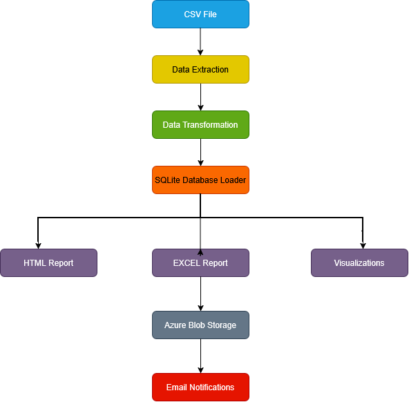
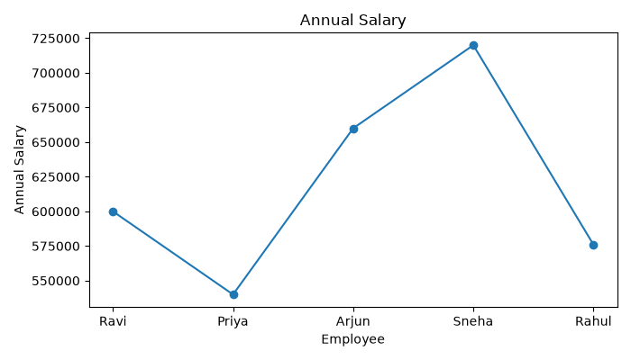
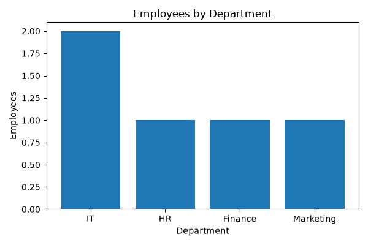
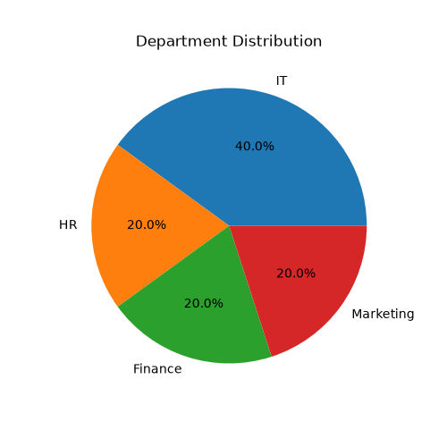

# 🚀 Automated ETL Pipeline with Cloud Integration & Automated Reporting

An end-to-end Python ETL Pipeline with Data Transformation, Reporting, Cloud Integration, and Email Automation.

## 📌 Project Overview

This project is an end-to-end **Automated ETL (Extract, Transform, Load) Pipeline** developed using Python. It extracts employee data from a CSV file, cleans and transforms it using Pandas, stores the processed data in a SQLite database, optionally uploads the processed data to Azure Blob Storage, generates Excel, HTML, and graphical reports, and can send automated email notifications with the generated reports.

The project follows a modular architecture where each ETL stage is implemented in a separate Python module, making the code reusable, maintainable, and easy to extend. Environment variables are securely managed using a .env configuration file, ensuring sensitive credentials are not exposed.

This project demonstrates practical data engineering concepts such as data extraction, transformation, loading, reporting, logging, cloud integration, and automation.

## ✨ Features

- Extract data from CSV files
- Read data from Azure SQL Database (Optional)
- Clean and transform data using Pandas
- Load data into SQLite database
- Generate HTML reports
- Generate Excel reports
- Create data visualizations
- Send reports through Email
- Azure Blob Storage upload support
- Logging for monitoring pipeline execution

---

## 🛠 Technologies Used

- Python 3
- Pandas
- SQLite3
- Matplotlib
- OpenPyXL
- HTML
- SMTP (Email Automation)
- Azure Blob Storage
- python-dotenv
- Logging Module
- Git
- GitHub

---

## 📂 Project Structure

```text
ETLProject/
│
├── data/
│   └── dummy_data.csv
│
├── etl/
│   ├── __init__.py
│   ├── extractor.py
│   ├── transformer.py
│   ├── loader.py
│   ├── viz.py
│   ├── html_report.py
│   ├── excel_report.py
│   ├── emailer.py
│   ├── azure_loader.py
│   ├── azure_sql_reader.py
│   ├── logger.py
│   └── config.py
│
├── reports/
│   ├── Employee_Report.xlsx
│   ├── annual_salary.png
│   ├── architecture.png
│   ├── department_count.png
│   ├── department_pie.png
│   ├── report.html
│   └── salary_chart.png
│
├── logs/
│
├── requirements.txt
├── run_etl.py
└── README.md
```
## 🏗 Project Architecture



### Workflow
```text
CSV File
     │
     ▼
Extractor
     │
     ▼
Transformer
     │
     ▼
Loader (SQLite)
     │
     ├────────► HTML Report
     ├────────► Excel Report
     ├────────► Visualizations
     ├────────► Azure Blob Storage
     └────────► Email Notification
```
---

## ⚙️ Workflow

1. Extract employee data from CSV or Azure SQL Database (Optional)
2. Clean and transform the extracted data
3. Load processed data into SQLite database
4. Generate data visualizations
5. Generate HTML report
6. Generate Excel report
7. Upload reports to Azure Blob Storage (Optional)
8. Send automated email notifications
9. Store execution logs

---

## 📊 Outputs

- SQLite Database (employee.db)
- Interactive HTML Report
- Employee_Report.xlsx
- Annual Salary Chart
- Department Distribution Pie Chart
- Department Count Chart
- Execution Log File

---
## 📸 Project Outputs

The following images show the reports and visualizations generated by the ETL pipeline after successful execution.

### Annual Salary Chart



### Department Count Chart



### Department Distribution Pie Chart



### HTML Report

The pipeline also generates an HTML report.

`reports/report.html`

### Excel Report

The pipeline generates an Excel report containing the processed employee data.

`reports/Employee_Report.xlsx`

## 🚀 Future Enhancements

- Apache Airflow Integration
- Power BI Dashboard
- Streamlit Dashboard
- Unit Testing using Pytest
- Docker Support
- Cloud Database Integration
- CI/CD using GitHub Actions

---

## ▶️ How to Run

Clone the repository:

```bash
git clone https://github.com/ammugondala/Automated-ETL-Pipeline-Python.git
```

Install dependencies:

```bash
pip install -r requirements.txt
```

Run the project:

```bash
python run_etl.py
```

---
## 📄 License

This project is intended for educational, learning, and portfolio purposes. It demonstrates ETL concepts, data processing, reporting, cloud integration, and automation using Python.
----

## 👩‍💻 Author

**Amruthavarshini**

GitHub: https://github.com/ammugondala